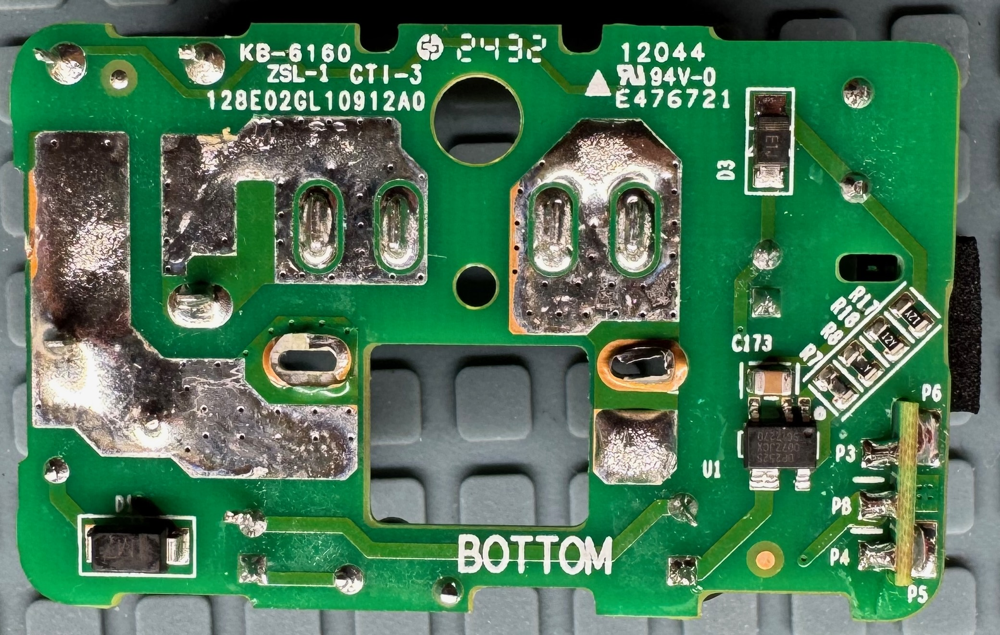
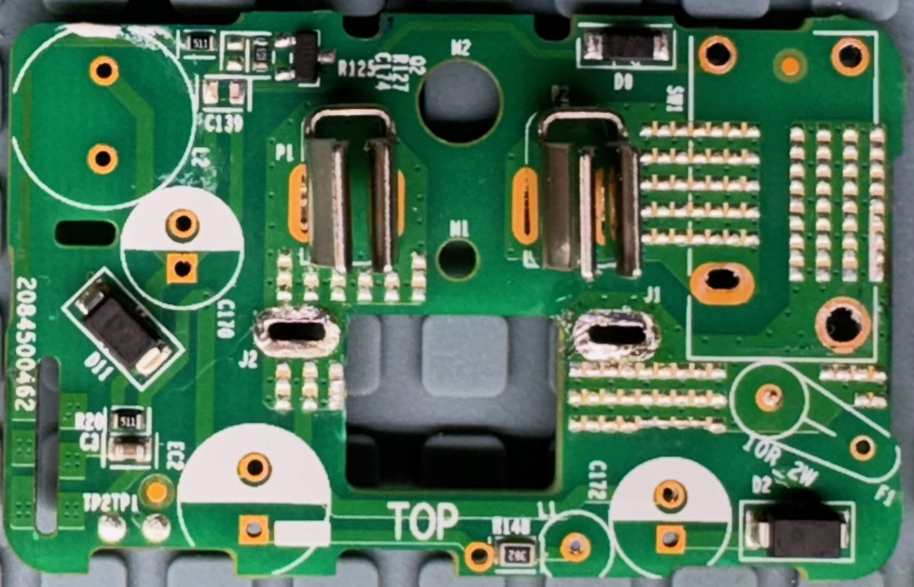
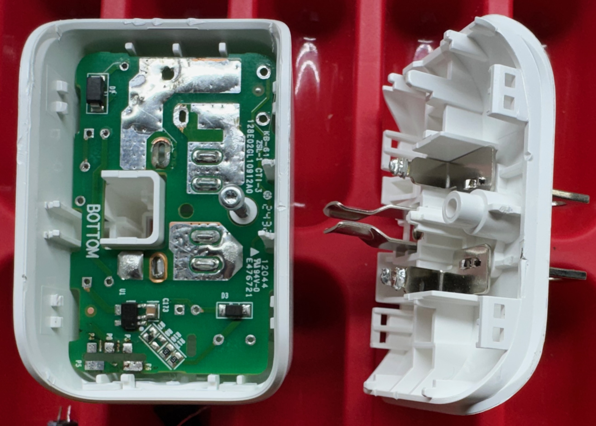

# Smart switched outlet (2025) teardown

## History and product overview

A smart switched outlet is actually a device that plugs into a non-switched
outlet and has its own power outlet on it. The device is controllable remotely
over Wi-Fi and allows the device to be turned on and off.

This smart switched outlet is sold by Tapo.
Tapo describes it as a Matter smart plug.
It uses Matter over IPv6 over WiFi. It does not use Thread.
This is for US voltage and outlets. It was purchased in July 2025.
The device allows switching of the outlet and remote monitoring of
the switch state.

## Electrical background

In the US most appliances use 3-prong plugs with two parallel blade conductors
for the power conduction and a round pin for the protective ground.
The standard outlet for 120V at up to 15A (60Hz) is a NEMA 5-15R.
The plug that goes into it is a NEMA 5-15P.
The power is provided with one blade conductor that is at 120VAC RMS potential
compared to ground (called live, line or hot) and one blade conductor that
is at zero potential compared to ground (called neutral or return).

Protective ground should never be interrupted so that the device is grounded even
when off.
To turn a device off it is only necessary to interrupt the power circuit at any
point. This will cease current flow.
However it is safer to do this by interrupting the live conductor. This means all
circuitry in attached appliance will be at 0V potential as both still connected
conductors are at 0V potential.
To ensure this requires a polarized plug. In the US this is done on
ungrounded plugs with two different sized blades, one too large to fit
in the hot slot. Grounded plugs with the round pin are inherently oriented
and do not need two different-sized blades.

## How it works

This device directly connects ground from the device socket to the wall plug
at all times. It also connects neutral continuously.
It accomplishes its switching by interrupting the live line using a relay.

The relay is controlled using a single bit from a controller board that drives
a GPO line high or low.

## Circuit analysis

[view schematic as a PDF here.](smart-outlet-t-reverse.pdf)

The device contains a transformerless switching power supply to generate a
neutral-referenced 5V supply.
It contains a controller sub-module which has a Realtek Bluetooth radio
and microcontroller (RTL8720CM) which utilizes a supply derived from
the 5.0V supply.
It uses a 277V/16A-rated relay on the live side to turn the connected device
on and off.

The board has about 2mm of creepage to conductors on the live (switched) side.
The protective ground pin is not connected to anything inside except the
output receptacle.
The controller uses a GPO to turn the relay on and off through an NPN transistor.
The power input is fused for the controlling circuitry with a fusible resistor.
The fusible resistor is sleeved in polyolefin heat shrink to protect
against a fuse explosion causing further internal damage like producing
short across the AC.
Power through the unit to the attached device is not protected with a fuse or similar.
The controller board appears to use a 5-pin switching power supply to cut
the provided 5V voltage down to that required by the Realtek MCU.
This is more expensive than an LDO but produces less heat. It saves
up to 700mW continuously versus an LDO.
The power lost in the fusible resistor is probably
several times larger than these savings and thus more than wipes them out.

### Main schematic page

C3 provides power smoothing for the controller board.

### Power supply page

The this uses a sophisticated neutral-referenced transformerless
switch-mode power supply (SMPS). The sophistication is mostly contained
within U1 and will not be fully explained here.

The short version is that U1 takes unregulated energy in and outputs
a reduced regulated voltage. It is capable of converting excess
voltage into increased current similar to how a transformer does
and the power (Watts) in is similar to the power out, just the
available voltage at the output is lower than the input and the
available current is increased inversely. It does this by rapidly
switching its output on and off to send energy into an inductor.
This inductor stores the energy in its magnetic field. It is drawn
off by the devices being supplied. It adjusts its switching duty
cycle so as to send the right amount of energy into the inductor
to match the energy being drawn out of the inductor and thus
keep the inductor voltage relatively constant. The inductor’s
resistance to current change and its ability to store energy in
its magnetic field are critical in making this happen.

Fused AC power at about 120V RMS comes in on FUSED_AC. D1 performs a positive
half-wave rectification on the AC. D2 applies a redundant half-wave
rectification. D2 is present only because diodes have some tendency to
become short circuits when failing. This would put AC voltage into the
circuit and produce a small conflagration within the device. By having two
diodes both D1 and D2 have to fail short to produce this result. This
should reduce the incidence of these small fires to the square of the
incidence rate with a single diode. So if this failure rate would be
one in one thousand over the life of the product then with two
consecutive diodes the failure rate would drop to one in a million
instead.

D2 allows C172 to be filled from FUSED_AC but not emptied. The voltage
on C172 will be relatively constant at the level of the highest positive
voltage on FUSED_AC although it will fall slowly as C172 is drained by
the devices it powers until the next positive AC sine wave arrives to
recharge it. This falling and rising is called ripple.
L1 operates as a filter to prevent high-frequency
voltage changes produced on HVDC from being presented on FUSED_AC. These
changes would produce RF noise on the AC lines which would cause the
device to fail FCC testing. L1 also helps to smooth the ripple from
passing to HVDC. EC2 acts as a final smoothing to make the power as
close to flat DC as possible.

U1 receives its initial power over pin 4. When operating it drives
current through L2 by driving it out through pin 5 into U1_GND
while the internal switch is on. Once it switches off current
continues through the catch diode D3. When operating it receives
its own regulated power output through pin 3 via D11.
C173 serves to smooth this voltage.

The top of C170 will be at the regulated voltage during operation.
R20 serves as a dummy load so as to make regulation easier at low
current draws.

### Power control page

Several functions are provided on this page. The simplest is to connect input
ground directly to the ground on the power outlet side and input neutral
directly to the neutral on the power outlet side.

The second function is to supply AC power to the power supply circuit
so it can create 5V DC power from the AC power. This is done via fuse F1.
F1 is a 10Ω fusible resistor that will fail at high currents due to heat.

The final function is to switch the output live power on and off
using a relay. Relay SW1 connects the output live to the wall source when
energized. SW1 is energized by the controller applying a positive
logic-level voltage on OUTPUT_ON. Once the base (pin 1) of Q2 is 0.6V
or more positive than the emitter (pin 2) then current flows into
the collector (pin 3) and out the emitter. This happens when POWER_EN
is driven high by the controller. This induces a current through R127
and the base. The current will be at least 6mA. This will cause Q1 to
attempt to drive sufficient current through the collector and the coil
of SW1 to energize SW1 fully. D9 serves to snub the voltage the
inductor (coil) in SW1 produces momentarily when Q2 is switched off.
R127 serves to to ensure Q2 turns off when desired.

## Meta-analysis

Any criticisms here are constructive and do not necessarily indicate a serious
flaw in the product.

The power supply chip employed suggests using a full-bridge rectifier for its AC input.
However this design uses half-wave. It does however put two diodes in series so that
a single diode failing short does not produce a short. This is probably a reasonable
design choice.
The switching power supply does not have an English language datasheet so it is
hard to determine if it is used correctly. Nor is it possible to tell the power
rating other than likely being under 1A due to the output capacitor being 10µF. It is
hard to understand how this chip could be designed with a current sense input which
requires a sense resistor so small even for these low current levels that the required
resistance is such that 4 resistors in parallel are needed to produce the value.

The device contains no X-class capacitor at all. This device is relying
on your wall circuit's protection for protection against overcurrent draw by the attached
device.

The device does not have a MOV for inrush limiting and instead seems to rely on
the metal film fusible resistor to control inrush.

The single button on the controlling board is gasketed against the case for some
protection against materials ingress through the button slit.
The ingressing material can still reach the
controlling board but not the high voltage areas. The device of course also has the
receptacle on the front and those are not sealed so water could ingress there also
as it could on any similar device.

The board is laid out in a very straightfoward way using traces for all the controlling
circuity. 3 floods do exist for the current to the controlled device. There are also
strange areas of bumps in the high current floods. I do not know what these are for.

This device uses no components smaller than an 0603.

This device puts the button on the controller board. This means pressing the button is
torquing the controller board in its socket. It is soldered in with a single shear
(attached only at one end) arrangement. Is this a problem? Probably not. It also puts
the LED on the controller board which mostly just means it is smaller and perhaps less
bright.

### teardown images

### Device identification

The device is approximately 60mm wide by 35mm high by 35mm deep (not including prongs).
It has a NEMA 5-15P on the back to plug into a US outlet. It has
a NEMA 5-15R on the front for plugging in the device you wish to switch.
It is rated for 15 amps out and 100-125V (presumably rms) in general use
(resistive load). It is rated for 8A (1kW!) incandescent load and 1/6HP motor load.

On the bottom it is identified as:

Mini Smart WiFi Plug

Model: Tapo 125M

It lists as FCC ID 2AXJ4P125

## Design tools

This is a KiCAD 9.X project. KiCAD is a free electronic design tool [available at kicad.org](https://kicad.org/).
